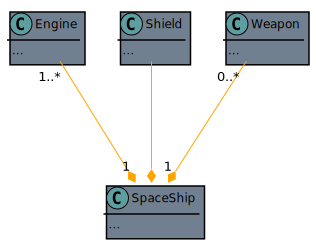

# LinkedIn Course: **Programming Foundations: Object-Oriented Design**

By: Olivia Chiu Stone and Barron Stone 
Released Nov 27, 2018

notes by Moana-Rose Marcello

---

# FUNDAMENTALS

## Object

All objects have...
| class name    | coffee mugs               | smart phones                  | bank accounts     |
| --- | --- | --- | --- |
| Identity      | my coffee mug             | Marvin's phone                | shared ING account    |
| Attributes    | color, size, fullness     | age, brand, operating system  | IBAN, balance, owner  |
| Behaviors    | fill(), empty(), clean()  | update(), refurbish(), call() | deposit(), withdraw() |

To determine if something in your code could be represented as an object, ask yourself if you can talk about it as a **noun**. 
Like
- things
- people
- places
- ideas
- concepts

as a rule of thumb ask yourself if you can put a *the* in front of it. 
This way methods like *ring*, *call* and *update* will disqualify themselves.

## Class

Code-template for creating program objects
> A class is the detailed description, the definition, the template of what an object will be but it isn't the object itself

It is typically sketched out like this:

| roundCookie |                 | barronCookie | oliviaCookie |
| :---------: | :-------------: | :----------: | :----------: |
| weight color icing |    | 16g red true | 12g brown false |
| decorate() consume() |     | decorate() consume() | decorate() consume() |

Class components:
- Name / Type: **What is it?** 
RoundCookie
- Attributes / Properties / Data: **What describes it?** 
weight, color, icing
- Behavior / Operations: **What can it do?** 
decorate(), consume()

A **method**...
- refers to a operation or behavior that is written out in code
- is a program procedure that can return a value (like a function)
- is defined as part of a class
- can only access data knows to its object

for each object oriented language there is a collection of ready made classes which can be found in the library

### 4 fundamental ideas when creating classes (*a pie*)

- **A**bstraction: 
focus on the essential qualities of something rather than on one specific example 
by using abstraction we automatically discard what's unimportant or irrelevant in our usecase
- **P**olymorphism: 
Dynamic (Run-Time) Polymorphism: 
defining different classes that can be used with the same interface 
Static (Compile-Time): 
overloading a method from the same class that can take different sets of parameters 
e.g.: brew(coffee, water) -> cupofcoffee, brew(tea, water) -> cupoftea, brew(coffee, tea, water) -> cupofsomething
- **I**nheritance: 
base a new class on an existing one 
inherit the existing attributes and methods 
great form of code reuse 
*Superclass / Parent class / Base class* vs. *Subclass / Child class / Derived class*
- **E**ncapsulation: 
blackboxing 
reduce dependencies inside the application

## Object Oriented... Analysis, Design and Programming

the idea: to develop your program you need to do Analysis (understand your problem), Design (plan your solution), Programming (build it).

This course will go through the Analysis (What do you need to do) and the Design (How will you do it).

1. Gather requirements
2. Describe the application
3. Identify the main objects
4. Describe the interactions
5. Create a class diagram

## Unified Modeling Language (UML)

Standardized notation for diagrams to visualize object-oriented systems. It includes more than a dozen different diagrams like:

- structural diagrams
    - class diagram
    - component diagram
    - deployment diagram
    - object diagram
    - package diagram
    - profile diagram
- behavioral diagrams
    - use case diagram
    - activity diagram
    - state machine diagram
    - sequence diagram
    - communication diagram
    - interaction overview diagram
    - timing diagram

In this course we will mostly be using *use case diagrams* and *class diagrams*.

Check out the [List of Unifies Modeling Language tools](https://en.wikipedia.org/wiki/List_of_Unified_Modeling_Language_tools) on wikipedia to find your UML-tool.

---

# REQUIREMENTS

**What must it do**

There are functional and non-functional requirements (e.g. legal, performance, support of security requirements). 
It is a trap to focus on some nifty extra feature before actually having nailed down the basic concept of a program. On the first round, only focus on the absoutely neccessary set of requirements. 
For the functional requirements, make a list that starts with: 
The system or application must (do)... 
For the non-functional requirements, make a list that starts with: 
The system or application should be... 
Requirements must not contain details for the actual programming (nothing about classes, objects, inheritance, etc.)

**FURPS** Requirements:
- **F**unctionality - what the user want (capability, reusability, security)
- **U**sability - affects the person who will be using the program (human factors, aesthetics, consistency, documentation)
- **R**eliability - availability, failure rate & duration, predictability
- **P**erformance - speed, efficiency, resource, consumption, scalability
- **S**upportability - testability, extensibility, serviceability, configurability

FURPS+ adds the following requirements:
- Design
- Implementation
- Interface
- Physical

---

## exercise: Spaceship Jukebox

### functional requirements

The jukebox must...
- connect to personal music library
- browse through personal music library
- select certain songs and add them to the playlist
- delete a song from the playlist
- maintain a queue of songs to play
- give access to multiple users at the same time
- distribute the playtime from different users fairly
- play music

### non-functional requirements:

The jukebox should be...
- safe to use in space
- easy and intuitive to use
- 100% reliable
- available 24/7
- low power

---

# USE CASES & USER STORIES

| User Stories | Use Cases |
| --- | --- |
| short (index card) | long (document) |
| one goal, no details | multiple goals and details |
| informal | casual to (very) formal |
| placeholder for conversation | record of conversation |

## Use Case

**title:** What is the goal?

**primary actor:** Who desires it?

**Success scenario:** How is it accomplished?

## User Stories

...are short enough to fit on an index card and typically written like: **"As a** *(type of user)* **I want** *(goal)* **so that** *(reason)***."** Where the *so that* part is optional.

## identify the actor

An actor can be a person, a different machine, a company, etc. - basically everything that interacts with the application.

*Primary* actors are all actors that initiate a use-case. All other actors are secondary actors

## identify the szenario

Focus on the *intention* and don't use words about the implementation (screen, click, button, select).

User-Focused Goals:
- cook meals
- generate reports
- change settings
- order supplies

not ~~turn on machine~~

Prompts to writing Use-Cases:
- what would I typically use this application for?
- who performs system administration tasks?
- who manages users and security?
- what happens if the system fails?
- is anyone looking at performance metrics or logs?

## draw a use-case diagram

1. list the goals in the middle, each goal in a separate bubble and draw a box around the goals
2. list the primary actors to the left and the secondary actors to the right of the use cases
3. draw lines between actors and the use-cases they will perform

---

## exercise: Spaceship Jukebox

### use case examples

> **Title** play a song 
> **Primary Actor** user 
> **Success Scenario**:
> 1. system identifies user
> 2. user browses library of available albums
> 3. user picks an album and browses list of songs in album
> 4. user selects a song
> 5. system plays selected song

> **Title** select multiple songs 
> **Primary Actor** user 
> 1. system identifies user
> 2. user browses available albums and songs
> 3. user selects a song
> 4. system begins playing selected song
> 5. user continues browsing and selects a second song
> 6. system adds second song to play queue
> 7. system plays second song after first song is over

### user story example
> As a *user*, I want *my song to be added to the front of a long play queue*, so that *I don't have to wait hours to hear it*.

> As a *user*, I want *to be identified without touching anything*, so that *my hands are free to do other things*.

> As a *user*, I want *to sort and browse songs by artist*, so that *I can listen to every song by ABBA*.

> As a *spaceships commander*, I want *the ability to cancel other user selections*, so that *I don't have to listen to disco all the way to the moon*.

---

# DOMAIN MODELING

So far we have been in the analysing phase and this is the first step into the design. We create a **conceptional model**, which represents important objects and the relationships between them.

1. identify potential objects
    1. browse through the use cases and user stories and create a list with all the nouns
    2. remove duplicates and see if you can group some together
    3. these are the names of potential objects and the beginning of a conceptional model
2. identify class relationships
    1. draw the potential objects on a pap er, each in their own box, unordered
    2. draw lines between boxes that have connection and give a short verb as description 
    try to avoid *uses* and be more specific (*steers*, *controls*, *fires*, ...)
    3. add some optional symbols to describe a bit more about the relationship and the objects 
    like how many there are
3. identify responsibilities
    1. browse through the use cases and user stories and create a list with all the actions
    2. figure out which objects will be responsible for these actions and add them to the diagram from above
    3. avoid pitfalls:
        - don't give one object too much responsibility (in a game the player initiates most of the actions but the action themselves will mostly live in the objects they are connected to)
        - usually there is no *system* object. Translate 'system' in user cases as 'some part of the system'
4. create **CRC** (**C**lass **R**esponsibility **C**ollaboration) Cards 
sometimes also known as **CRH** (**C**omponent **R**esponsibilities **H**elper) cards 
with the potential object on top and two columns: one for the responsibilities and another for connections to other objects

---

## exercise: Spaceship Jukebox

the collaborations can be nicely displayed by lines between the objects while the responsibilities are only within the objects

### **ADMIN:**
| RESPONSIBILITY | COLLABORATION |
| :---: | :---: |
| | moderates QUEUE|

### **QUEUE:**
| RESPONSIBILITY | COLLABORATION |
| :---: | :---: |
| add SONG get next SONG remove SONG identify USER | gets id from USER contains multiple SONGS |

### **SONG:**
| RESPONSIBILITY | COLLABORATION |
| :---: | :---: |
| play | is in QUEUE is in ALBUM selected by USER |

### **ALBUM:**
| RESPONSIBILITY | COLLABORATION |
| :---: | :---: |
| display SONGS select SONG | contains multiple SONGS browsed by USER is in LIBRARY |

### **LIBRARY:**
| RESPONSIBILITY | COLLABORATION |
| :---: | :---: |
| display ALBUMS select ALBUM | contains ALBUMS browsed by USER |

### **USER:**
| RESPONSIBILITY | COLLABORATION |
| :---: | :---: |
| | browses LIBRARY browses ALBUM selects SONG sends id to QUEUE |

In a diagram:

    
in PlantUML

    @startuml DomainModeling

    skinparam class {
        BackgroundColor SlateGrey
        ArrowColor Orange
        BorderColor Black
    }
    skinparam stereotypeCBackgroundColor CadetBlue
    skinparam backgroundColor DarkSlateGrey

    class Admin {

    }

    class Song {
        {method} play
    }

    class Album {
        {method} display song
        {method} select song
    }

    class Library {
        {method} display album
        {method} select album
    }

    class Queue {
        {method} add song
        {method} get next song
        {method} remove song
        {method} identify user

    }

    class User {

    }

    Library "1" *-d- "1...*" Album
    Album "1" *-d- "1...*" Song
    Queue "1" *--- "1...*" Song
    Admin --> Queue : manages
    User -r-> Library : browses
    User -r-> Album : browses
    User -r-> Song : selects
    User -r-> Queue : sends ID

    @enduml

---

# CREATING A CLASS DIAGRAM

| ClassName (singular and capital) |
| --- |
| **Attributes**  *var_name*: *type* (where *var_name* can be lower_case or camelCase and *type* is optional) |
| **Behaviors**  *functionname(params): return* (where *params* and *return* are optional) |

- Resist the temptation to skip the previous analysis and design steps and creating the class right away. It will result in objects that focus on their data rather than on their methods.
- So don't worry: in this phase of the design we don't know so much of the attributes yet, which is a good thing
- attributes and behaviors with a '+' are visible and accessible to other classes
- attributes and behaviors with a '-' are not visible and nor accessible to other classes

## typical class diagram:

    
in PlantUML

    @startuml CreatingAClassDiagram

    skinparam class {
        BackgroundColor SlateGrey
        ArrowColor Orange
        BorderColor Black
    }
    skinparam stereotypeCBackgroundColor CadetBlue
    skinparam backgroundColor DarkSlateGrey

    class Spaceship {
        - name: string="the nameless ship"
        - shieldActive: boolean
        - position: coordinate
        + getShieldStrength(): integer
        + reduceShields(integer)
        + getPosition(): coordinate
        + move(direction)
        - setPosition(coordinate)
    }

    class Legend {
        - private attribute
        + public attribute
        {method} - private method
        {method} + public method
    }
    @enduml

---

# convertion into code

- When I create an instance of a class - an object - memory for this object is being allocated and the variables are filled with the default values. The **constructor** is used to make these values more meaningful.
- A **destructor** or **finalizer** (for languages with garbage collection) which is called when an object is no longer needed; typically it would close a document or disconnect from a database.
- **attributes** are living inside objects and changing the attribute of one object won't change the value of another object
- **static variables** are shared across all objects in a class and are also called **shared variables** or **class variables**
    - you can access class variables by *ClassName.var_name*
    - in UML indicated with an underline
- **static methods** are similar to static variables in the sense that they exits in the scope of the whole class and not within instances of that class
    - you can access static methods by *ClassName.method(params)*
    - they can only access static variables
    - in UML indicated with an underline

---

## exercise: Spaceship Jukebox

    
in PlantUML

    @startuml ConvertionIntoCode
    skinparam class {
        BackgroundColor SlateGrey
        ArrowColor Orange
        BorderColor Black
    }
    skinparam stereotypeCBackgroundColor CadetBlue
    skinparam backgroundColor DarkSlateGrey

    class Admin {
        - id: integer
        + getID(): integer
        + createUser(): User
        + manageQueue()
    }

    class Song {
        - title: string
        - artist: string
        - album: string
        + getName(): string
        + getArtist(): string
        + getAlbum(): string
        + play()
    }

    class Album {
        - name: string
        - songs: Song[1...*]
        + getName(): string
        + getSongTitles(): string[1...*]
        + getSong(string): Song
    }

    class Library {
        - albums: Album[1...*]
        + getAlbumTitles(): string[1...*]
        + getAlbum(string): Album
    }

    class Queue {
        - current: Song
        - next: Song linked list
        - songsByUser: dict
        + add(Song, integer)
        + remove(Song)
        - getNextSong(): Song
    }

    class User {
        - id: integer
        + getID(): integer
    }

    @enduml

---

# inheritance & composition

## Inheritance

    
in PlantUML

    @startuml Inheritance
    skinparam class {
        BackgroundColor SlateGrey
        ArrowColor Orange
        BorderColor Black
    }
    skinparam stereotypeCBackgroundColor CadetBlue
    skinparam backgroundColor DarkSlateGrey

    abstract class SpaceShip {
        shieldActive: bool
        shieldStrength: int
        position: coordinates
        setShield()
        move()
    }

    class StarFighter {
        move()
        fireMissile()
    }

    class CargoShuttle {
        move()
        dropCargo()
    }

    class WarpCruiser {
        move()
    }

    StarFighter ---|> SpaceShip
    CargoShuttle ---|> SpaceShip
    WarpCruiser ---|> SpaceShip

    abstract class SpaceShip
    note right: Abstract class

    @enduml

- describes an '... is a (type or kind of)...' relationship:
    - 'A StarFighter is a (type or kind of) SpaceShip.'
    - 'A CargoShuttle is a (type or kind of) SpaceShip.'
    - 'A CargoShuttle ~~is a (type or kind of)~~ StarFighter.'
- superclass vs subclass, base class vs derived class, parent class vs child class
- A subclass can override methods it inherits from its superclass with its own version.
- can be multiple levels deep
a superclass can have multiple subclasses
- most languages (exception C++, python) only allow one superclass per subclass
- shouldn't be forced: inheritance usually announces itself
- a superclass can be an **Abstract Class** (vs. Concrete or Final Class) is a super class, that:
    - represents a type
    - exists for other classes to inherit
    - cannot be instantiated
    - contains at least one abstract method that will need to be implemented in the subclasses (move() in our  example)
    - in UML indicated by *italic* name

## Interface

    
in PlantUML

    @startuml Interface
    skinparam class {
        BackgroundColor SlateGrey
        ArrowColor Orange
        BorderColor Black
    }
    skinparam stereotypeCBackgroundColor CadetBlue
    skinparam backgroundColor DarkSlateGrey

    abstract class SpaceShip {
        shieldActive: bool
        shieldStrength: int
        position: coordinates
        setShield()
        move()
    }

    class StarFighter {
        move()
        draw()
        fireMissile()
    }

    class CargoShuttle {
        move()
        draw()
        dropCargo()
    }

    class WarpCruiser {
        move()
        draw()
    }

    class Asteroid {
        move()
        draw()
    }

    interface Movable <<interface>> {
        move()
    }

    interface Drawable <<interface>> {
        draw()
    }

    hide <<interface>> fields

    StarFighter -u-|> SpaceShip
    CargoShuttle -u-|> SpaceShip
    WarpCruiser -u-|> SpaceShip
    SpaceShip .u.|> Movable
    Asteroid .u.|> Movable
    Asteroid .u.|> Drawable
    StarFighter .u.|> Drawable
    CargoShuttle .u.|> Drawable
    WarpCruiser .u.|> Drawable

    note "Interface" as N1

    Movable -- N1
    Drawable -- N1

    @enduml

- list of method prototypes for a class to implement
- doesn't contain any actual behavior
- when defining a new class with a specific interface, we are effectively promising that the new class will implement all of the methods-prototypes in that interface
- represent a capability (vs. abstract class which represents a type)
- a class can inherit from multiple interfaces
- highly recommended:
    - favorable to inheritance
    - it is more future friendly than using inheritance due to the fact that the implementation is in the class and not in the abstract or superclass

> Program to an interface, not to an implementation

## Composition

    
in PlantUML

    @startuml Composition

    skinparam class {
        BackgroundColor SlateGrey
        ArrowColor Orange
        BorderColor Black
    }
    skinparam stereotypeCBackgroundColor CadetBlue
    skinparam backgroundColor DarkSlateGrey

    class SpaceShip {
    ...
    }

    class Engine {
    ...
    }

    class Shield {
    ...
    }

    class Weapon {
    ...
    }

    hide class method

    Engine "1..*" ---* "1" SpaceShip
    Shield ---* SpaceShip
    Weapon "0..*" ---* "1" SpaceShip

    @enduml

- describes a '... owns a(n) ...' relationship
- key difference to aggregation: if the owning object is destroyed, the contained objects are destroyed as well
- often worth showing in a diagram (for example to not forget to write constructor and destructor methods)

## Aggregation

    
in PlantUML

    @startuml Aggregation
    skinparam class {
        BackgroundColor SlateGrey
        ArrowColor Orange
        BorderColor Black
    }
    skinparam stereotypeCBackgroundColor CadetBlue
    skinparam backgroundColor DarkSlateGrey

    class Fleet {

    }
    hide Fleet method
    hide Fleet fields

    class StarFighter {
        move()
        draw()
        fireMissile()
    }

    class CargoShuttle {
        move()
        draw()
        dropCargo()
    }

    class WarpCruiser {
        move()
        draw()
    }

    StarFighter "0..*" ---o "1" Fleet
    CargoShuttle "0..*" ---o "1" Fleet
    WarpCruiser "0..*" ---o "1" Fleet

    @enduml

- describes a '... uses a(n) ...' relationship:
    - 'A Fleet uses a SpaceShip.'
    - 'A Fleet ~~is a~~ SpaceShip.'
- may not always be worth showing on a diagram
- the lifetime of the objects are not bound to the lifetime of the aggregation class (if you end the fleet, the ships will still be there) which is also the key difference to composition

---

## exercise: Spaceship Jukebox

    
in PlantUML

    @startuml InheritanceAndComposition
    skinparam class {
        BackgroundColor SlateGrey
        ArrowColor Orange
        BorderColor Black
    }
    skinparam stereotypeCBackgroundColor CadetBlue
    skinparam backgroundColor DarkSlateGrey

    interface Browsable <<interface>> {
        + getTitles(self): string[1..*]
        + getItem(self, string): item
    }

    interface Identifyable <<interface>> {
        + getID(self): string
    }

    class Admin {
        + createUser(): User
        + manageQueue()
    }

    class Song {
        - id: string
        - artist: string
        - album: string
        + getArtist(): string
        + getAlbum(): string
        + play()
    }

    class Album {
        - id: string
        - songs: Song[1...*]
    }

    class Library {
        - albums: Album[1...*]
    }

    class Queue {
        - current: Song
        - next: Song linked list
        - songsByUser: dict
        + add(Song, integer)
        + remove(Song)
        - getNextSong(): Song
    }

    class User {
        - id: string
    }

    hide <<interface>> fields

    Library .u.|> Browsable
    Album .u.|> Browsable
    Album .u.|> Identifyable
    Song .u.|> Identifyable
    User .u.|> Identifyable
    Song "1..*" --* "1" Album
    Album "1..*" --* "1" Library
    Song "0..*" --o "1" Queue
    Admin -u-|> User

    @enduml
    

---

# SOFTWARE DEVELOPMENT

| Language | Inheritance | Call to Parent | Typing | Interface | Abstract Classes |
| :-: | :-: | :-: | :-: | :-: | :-: |
| Java | single | super | static | yes | yes |
| C# | single | base | static | yes | yes |
| python | multiple | super | dynamic | Abstract Class | yes |
| swift | single | super | static | Protocols | no |
| C++ | multiple | NameofClass:: | static | Abstract Class | yes |
| Ruby | mixins | super | dynamic | n/a | n/a |
| JavaScript | prototypes | n/a | dynamic | n/a | n/a |

---

## Further readings

- [SOLID](https://en.wikipedia.org/wiki/SOLID)
    - **S**ingle responsibility (A class should only have a single responsibility, that is, only changes to one part of the software's specification should be able to affect the specification of the class.)
    - **O**pen/closed ("Software entities ... should be open for extension, but closed for modification.")
    - **L**iskov substitution ("Objects in a program should be replaceable with instances of their subtypes without altering the correctness of that program." See also [design by contract](https://en.wikipedia.org/wiki/Design_by_contract))
    - **I**nterface segregation ("Many client-specific interfaces are better than one general-purpose interface.")
    - **D**ependency inversion (One should "depend upon abstractions, [not] concretions.")

- [DRY](https://en.wikipedia.org/wiki/Don%27t_repeat_yourself) (**D**on't **R**epeat **Y**ourself)
- [YAGNI](https://en.wikipedia.org/wiki/You_aren%27t_gonna_need_it) (**Y**ou **A**in't **G**onna **N**eed **I**t)
- [Code Smell](https://en.wikipedia.org/wiki/Code_smell) - tools for automatically finding some of the above issues.
- [Design Patterns](https://en.wikipedia.org/wiki/Design_Patterns) for structuring your code in a maintainable way
